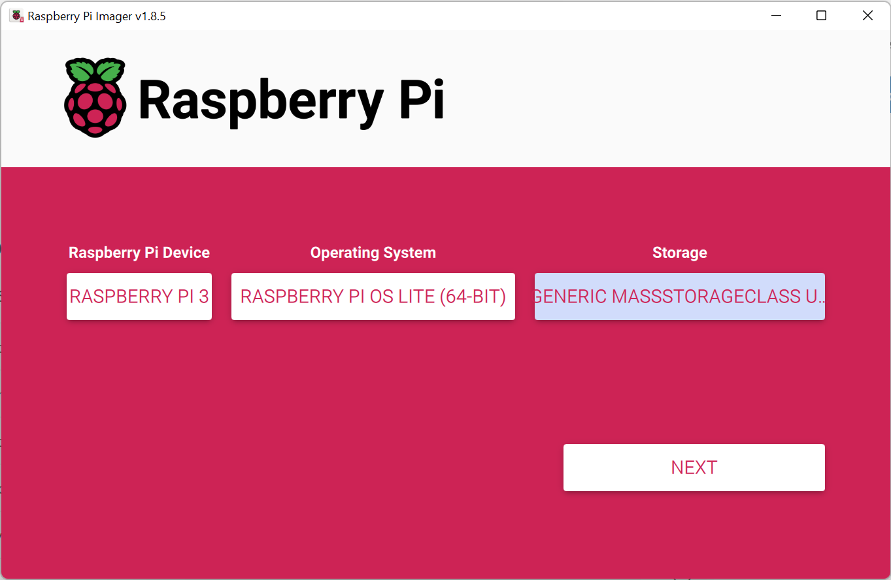

# Raspberry PI

Raspberry PI controlling the column lights.

## Setup

### Flash Raspberry Pi OS image

Start with flashing a Raspberry PI OS image using the [Raspberry PI Imager](https://www.raspberrypi.com/software/).

Download the appropriate version for your platform and start the imager.

Select the following options:

> Raspberry PI Device: _Raspberry PI 3_  
> Operating System: _Raspberry Pi OS (other) > Raspberry Pi OS Lite (64-bit)_  
> Storage: _the SD card to install Raspberry Pi OS on._

Then select _Next_ and _Edit Settings_.

Under _General_ enable _Set username and password_ (default: `simon` with password `column`) and _Set hostname_ (default: `column`.local).

Then under _Services_ enable `Enable SSH` with _Use password authentication_.

Now press _Save_, then _Yes_, and then confirm you want to continue.

The imager will now write the OS to the SD Card and afterwards verify.

When all done place the SD Card in the Raspberry PI and connect the PI to a local network using an ethernet cable.
